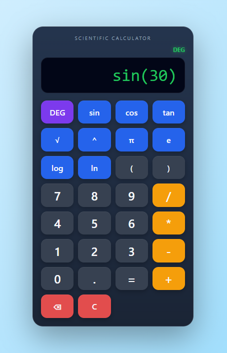

# Scientific Calculator

This is a scientific calculator that i built using HTML, CSS and JavaScript as a way to strengthen my understanding of JavaScript and data structures.

Unlike a basic calculator that relies on eval(), this project uses a custom expression parser. The calculator tokenizes the input expression, converts it from infix to postfix notation using the Shunting Yard algorithm, and then evaluates the postfix expression.

## Features

- Basic arithmetic operations (+, -, *, /)
- Parentheses support
- Exponentiation (^)
- Unary minus support
- Square root function
- Trigonometric functions (sin, cos, tan)
- Logarithmic functions (log, ln)
- Mathematical constants (π, e)
- DEG/RAD mode for trigonometric calculations
- Custom tokenizer
- Infix to Postfix conversion
- Postfix expression evaluation

## What I Learned

Through this project, I learned:

- DOM manipulation
- Event handling in JavaScript
- Object-based operation mapping
- Expression tokenization
- The Shunting Yard algorithm
- Postfix expression evaluation using stacks
- Error handling
- Building a complete project without using eval()

## Future Improvements

Some features I may add in the future:

- Calculation history
- Implicit multiplication (2π, 2(3+4))
- Additional scientific functions

## Overview

  

## Demo

https://githubusercontent.com/TamannaBanik/Scientific-Calculator/raw/refs/heads/main/images/demo.mp4